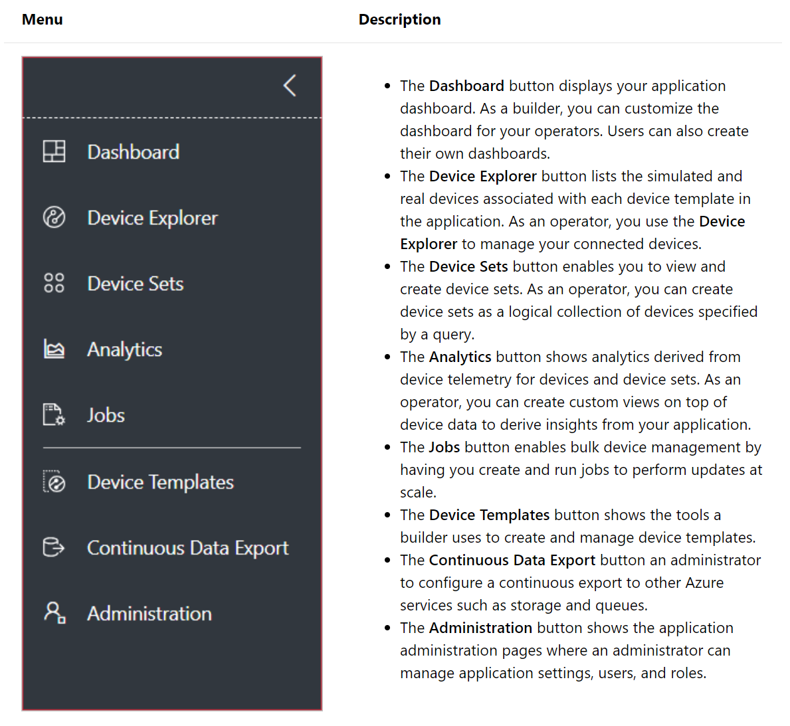
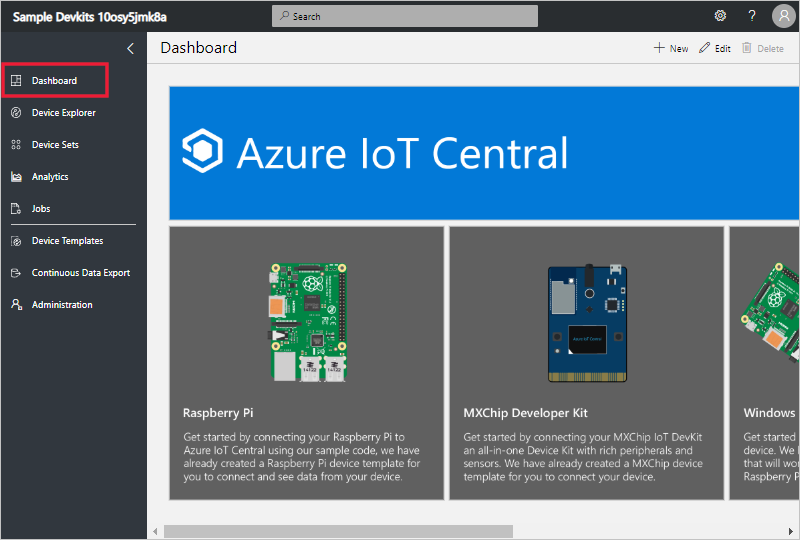
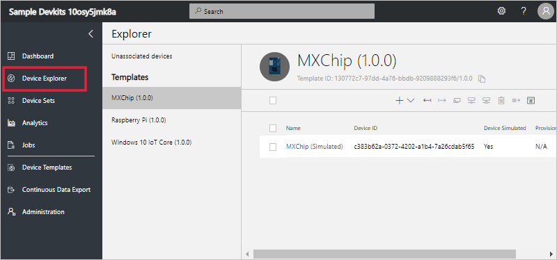
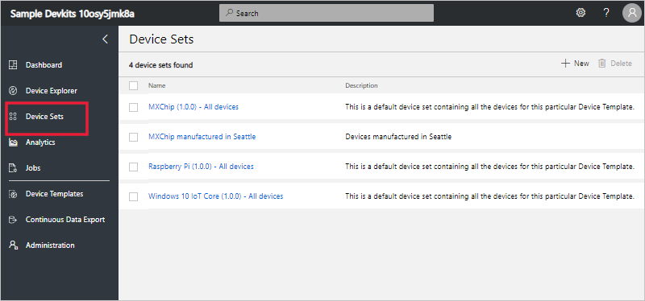
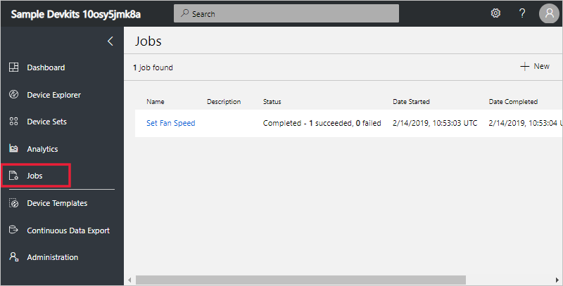
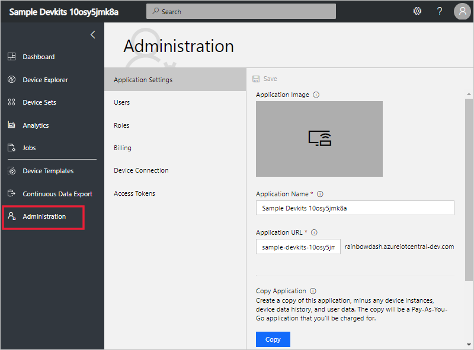

# Take a tour of the Azure IoT Central UI

This article introduces you to the Microsoft Azure IoT Central UI. You can use the UI to create, manage, and use an Azure IoT Central solution and its connected devices.

As a _builder_, you use the Azure IoT Central UI to define your Azure IoT Central solution. You can use the UI to:

- Define the types of device that connect to your solution.
- Configure the rules and actions for your devices.
- Customize the UI for an _operator_ who uses your solution.

As an _operator_, you use the Azure IoT Central UI to manage your Azure IoT Central solution. You can use the UI to:

- Monitor your devices.
- Configure your devices.
- Troubleshoot and remediate issues with your devices.
- Provision new devices.

## Use the left navigation menu

Use the left navigation menu to access the different areas of the application. You can expand or collapse the navigation bar by selecting **<** or **>**:

## Search, help, and support

The top menu appears on every page:

- To search for device templates and devices, enter a **Search** value.
- To change the UI language or theme, choose the **Settings** icon.
- To sign out of the application, choose the **Account** icon.
- To get help and support, choose the **Help** drop-down for a list of resources. In a trial application, the support resources include access to [live chat](https://docs.microsoft.com/en-us/azure/iot-central/howto-show-hide-chat?WT.mc_id=github-blog-dglover).

You can choose between a light theme or a dark theme for the UI:

## Dashboard

The dashboard is the first page you see when you sign in to your Azure IoT Central application. As a builder, you can customize the application dashboard for other users by adding tiles. To learn more, see the [Customize the Azure IoT Central operator's view](https://docs.microsoft.com/en-us/azure/iot-central/tutorial-customize-operator?WT.mc_id=github-blog-dglover) tutorial. Users can also [create their own personal dashboards](https://docs.microsoft.com/en-us/azure/iot-central/howto-personalize-dashboard?WT.mc_id=github-blog-dglover).

## Device explorer

The explorer page shows the _devices_ in your Azure IoT Central application grouped by _device template_.

* A device template defines a type of device that can connect to your application. To learn more, see the [Define a new device type in your Azure IoT Central application](https://docs.microsoft.com/en-us/azure/iot-central/tutorial-define-device-type?WT.mc_id=github-blog-dglover).
* A device represents either a real or simulated device in your application. To learn more, see the [Add a new device to your Azure IoT Central application](https://docs.microsoft.com/en-us/azure/iot-central/tutorial-add-device?WT.mc_id=github-blog-dglover).

## Device sets

The _device sets_ page shows device sets created by the builder. A device set is a collection of related devices. A builder defines a query to identify the devices that are included in a device set. You use device sets when you customize the analytics in your application. To learn more, see the [Use device sets in your Azure IoT Central application](https://docs.microsoft.com/en-us/azure/iot-central/howto-use-device-sets?WT.mc_id=github-blog-dglover) article.

## Analytics

The analytics page shows charts that help you understand how the devices connected to your application are behaving. An operator uses this page to monitor and investigate issues with connected devices. The builder can define the charts shown on this page. To learn more, see the [Create custom analytics for your Azure IoT Central application](https://docs.microsoft.com/en-us/azure/iot-central/howto-use-device-sets?WT.mc_id=github-blog-dglover) article.

## Jobs

The jobs page allows you to perform bulk device management operations onto your devices. The builder uses this page to update device properties, settings, and commands. To learn more, see the [Run a job](https://docs.microsoft.com/en-us/azure/iot-central/howto-run-a-job?WT.mc_id=github-blog-dglover) article.

## Device Templates

The device templates page is where a builder creates and manages the device templates in the application. To learn more, see the [Define a new device type in your Azure IoT Central application](https://docs.microsoft.com/en-us/azure/iot-central/tutorial-define-device-type?WT.mc_id=github-blog-dglover) tutorial.

## Continuous Data Export

The continuous data export page is where an administrator defines how to export data, such as telemetry, from the application. Other services can store the exported data or use it for analysis. To learn more, see the [Export your data in Azure IoT Central](https://docs.microsoft.com/en-us/azure/iot-central/howto-export-data?WT.mc_id=github-blog-dglover) article.

## Administration

The administration page contains links to the tools an administrator uses such as defining users and roles in the application. To learn more, see the [Administer your Azure IoT Central application](https://docs.microsoft.com/en-us/azure/iot-central/howto-administer?WT.mc_id=github-blog-dglover) article.